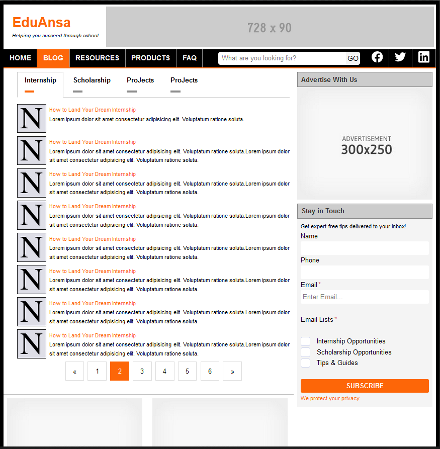

# EduAnsa

EduAnsa is a static website developed as a go-to resource for students.

Even though EduAnsa is a static website, it is build with reusable HTML components (partial HTML files) to avoid HTML duplications. These partial HTML files are combined together using the `Apache server INCLUDE` statement written in the `.htaccess` file.

```html
<body>
  <div id="container">
    <!--#include virtual="include/header.html" -->
    <main>
      <article>
        <!--#include virtual="include/author-bio.html" -->
        <!--#include virtual="include/right-sidebar.html" -->
      </article>
    </main>
    <!--#include virtual="include/footer.html" -->
  </div>
  <script src="js/main.js"></script>
</body>
```

## Tech Stack

- [x] HTML
- [x] CSS (SCSS)
- [x] Vanilla JavaScript

## Sample Pages


_Sample Home Page_



_Blog Page_
